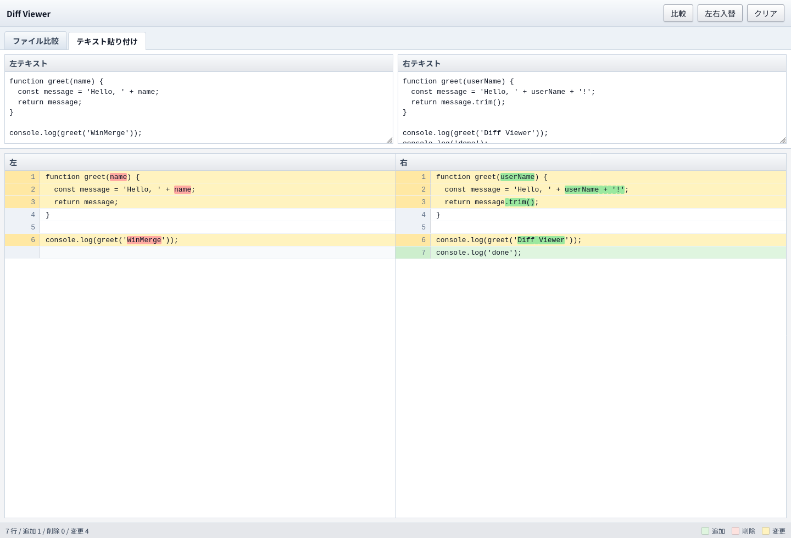

# Diff Viewer

ブラウザだけで動作するWinMerge風の差分表示ツールです。サーバーや外部ライブラリは不要で、`index.html` を直接開いて使えます。

## スクリーンショット

## 使い方

1. `index.html` をブラウザで開きます。
2. `ファイル比較` タブで左右のファイルを選択するか、`テキスト貼り付け` タブで左右の入力欄へ直接貼り付けます。
3. 差分が左右2ペインで表示されます。

## 機能

- サーバー不要、オフライン動作
- `index.html` のみで動作
- 左右2ペインの差分表示
- ファイル読込
- 行単位diff
- 変更行の単語単位ハイライト
- スクロール同期
- 行番号表示
- 追加は緑、削除は赤、変更は黄色で表示

## セキュリティ

- 入力内容は外部へ送信しません。
- 外部スクリプト、外部CSS、CDNを使いません。
- 差分表示はDOM生成と `textContent` を使い、ユーザー入力をHTMLとして解釈しません。

## 制約

- 差分表示専用です。マージ機能はありません。
- 巨大ファイルではブラウザのメモリや処理速度の影響を受けます。
